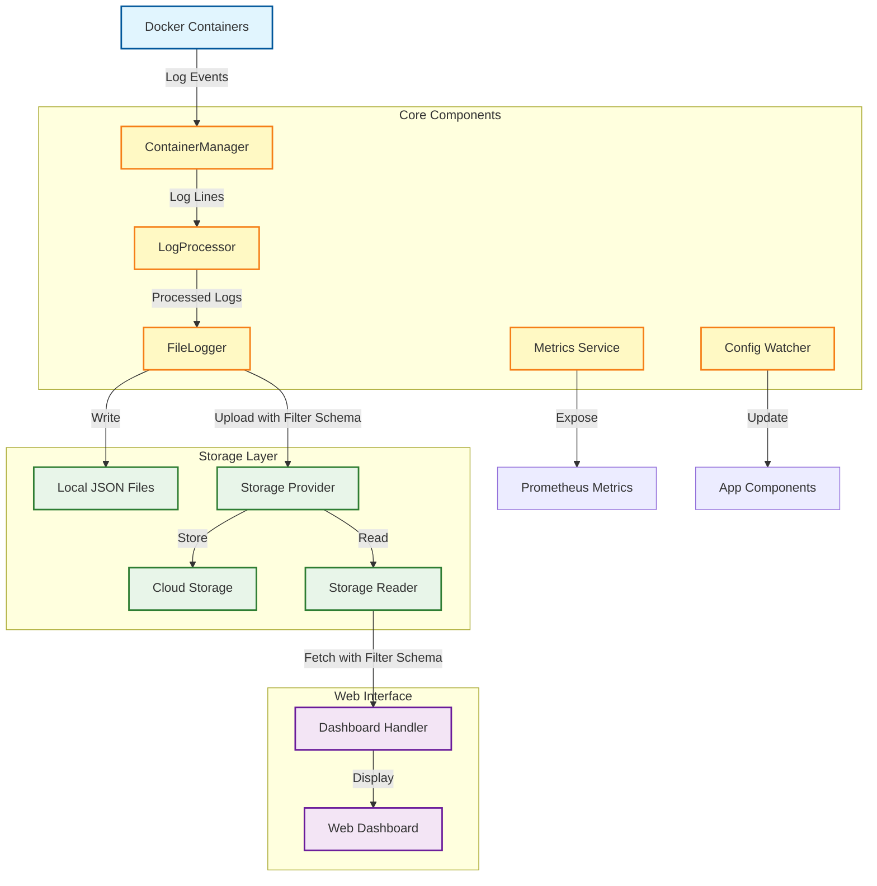

# Docker Container Logger

A high-performance Docker container log collector that tails logs from Docker containers, writes them to daily JSON files, uploads logs to cloud storage, and exposes Prometheus metrics.

## Features

- Tails logs from Docker containers in real-time
- Writes logs to daily JSON files
- Uploads logs to multiple cloud storage providers (AWS S3, Google Cloud Storage, Aliyun OSS)
- Exposes Prometheus metrics for monitoring
- Supports dynamic configuration reload
- Handles container lifecycle events
- Graceful shutdown handling

## Configuration

The application is configured via a JSON configuration file. Here's an example configuration:

```json
{
  "filter_labels": [
    "com.docker.swarm.service.name=wadugs-api-local"
  ],
  "all_containers": true,
  "format": "json",
  "max_streams": 50,
  "tail_buffer_size": 1000,
  "write_buffer_size": 1000,
  "since_window_seconds": 5,
  "gc_percent": 100,
  "drop_on_full": false,
  "metrics_addr": ":8090",
  "rollover_minutes": 10,
  "file_name_pattern": "2006-01-02",
  "storage": {
    "type": "dummy",
    "config": {
      "bucket_name": "my-logs-bucket",
      "region": "us-west-2"
    }
  },
  "filter": {
    "type": "logall",
    "config": {}
  }
}
```

Docker swarm label example :

```json
{
    "com.docker.swarm.node.id": "n59savkwisgcyg3c22z5uxzh4",
    "com.docker.swarm.service.id": "nivbve1iaxxuqvaima6mtymoh",
    "com.docker.swarm.service.name": "wadugs-api-local",
    "com.docker.swarm.task": "",
    "com.docker.swarm.task.id": "j37x9y6lsnq1se0fp8neokzp4",
    "com.docker.swarm.task.name": "wadugs-api-local.1.j37x9y6lsnq1se0fp8neokzp4"
}
```

Docker compose label example :
```json
{
    "com.docker.compose.config-hash": "32dee00a68f0f0a0a4923668a2b25b1937494b0d1b2c7d94e049cc7ab801d963",
    "com.docker.compose.container-number": "1",
    "com.docker.compose.depends_on": "",
    "com.docker.compose.image": "sha256:4998f471de0609e6cb4ca7cf2f5c39f994d6b6b10dbb23dfd759c97f4af3e421",
    "com.docker.compose.oneoff": "False",
    "com.docker.compose.project": "wadugs-api",
    "com.docker.compose.project.config_files": "/Users/harry/go/src/github.com/denys89/wadugs-api/docker-compose.yml",
    "com.docker.compose.project.working_dir": "/Users/harry/go/src/github.com/denys89/wadugs-api",
    "com.docker.compose.service": "swagger",
    "com.docker.compose.version": "2.30.3",
    "maintainer": "fehguy"
}
```


### Configuration Options

| Option | Description | Default |
|--------|-------------|--------|
| `max_streams` | Maximum number of concurrent container streams | 50 |
| `since_window_seconds` | Seconds before container stop to include logs | 5 |
| `metrics_addr` | Address to expose Prometheus metrics | ":8080" |
| `tail_buffer_size` | Buffered channel size for log reading | 1000 |
| `write_buffer_size` | Buffered channel size for file writes | 1000 |
| `drop_on_full` | Drop writes when buffer is full instead of blocking | false |
| `format` | Output format: json or plain | "json" |
| `filter_labels` | Labels to filter containers by | ["com.docker.swarm.service.name"] |
| `all_containers` | Tail logs from all containers | false |
| `gc_percent` | Garbage collection percentage | 100 |
| `rollover_minutes` | Minutes between log file rollovers and uploads | 1440 (daily) |
| `file_name_pattern` | Go time format for log file names | "2006-01-02" (daily) |
| `all_containers` | Tail logs from all containers | false |
| `storage.type` | Storage provider type (s3, gcs, aliyun) | "s3" |
| `storage.config` | Provider-specific configuration | {} |
| `filter.type` | Log filter type (logall) | "logall" |
| `filter.config` | Filter-specific configuration | {} |

## Command-line Arguments

The application also accepts command-line arguments that override the configuration file:

```
-config string
    Path to JSON config file (default "config.json")
```

## Log File Management

### File Naming

Log files are named according to the `file_name_pattern` configuration using Go's time format patterns. Some examples:

| Pattern | Example Filename | Description |
|---------|-----------------|-------------|
| `2006-01-02` | `2025-06-02.json` | Daily files (default) |
| `2006-01` | `2025-06.json` | Monthly files |
| `2006-01-02-15` | `2025-06-02-16.json` | Hourly files |
| `2006-01-02-15-04` | `2025-06-02-16-43.json` | Per-minute files |

### Rollover Schedule

Log files are rolled over and uploaded to storage based on the `rollover_minutes` configuration. Some examples:

| Value | Description |
|-------|-------------|
| 10 | Every 10 minutes |
| 60 | Hourly |
| 1440 | Daily (default) |
| 10080 | Weekly |

When a rollover occurs, the current log file is closed, a new one is created if needed, and the old file is uploaded to the configured storage provider. After a successful upload, the local file is cleared to save disk space.

## Log Filters

The application supports configurable log filtering and transformation before logs are written to files. This allows you to filter out unwanted logs or transform log entries before they're stored and uploaded.

### Filter Configuration

Filters are configured similarly to storage providers:

```json
"filter": {
  "type": "logall",
  "config": {}
}
```

### Available Filters

#### LogAll Filter

The default filter that passes all logs through without modification:

```json
{
  "filter": {
    "type": "logall",
    "config": {}
  }
}
```

## Storage Providers

The application supports multiple storage providers for log uploads. When logs are uploaded, they are merged with the remote file if it already exists, allowing for aggregation of logs into daily or monthly files based on the configured `file_name_pattern`. All logs are stored in a schema-based JSON format that reduces redundancy by storing field names once in a schema array.

### AWS S3

```json
{
  "storage": {
    "type": "s3",
    "config": {
      "bucket_name": "my-logs-bucket",
      "folder_path": "folder/path",
      "region": "us-west-2",
      "endpoint": "https://s3.us-west-2.amazonaws.com",
      "prefix": "logs/",
      "access_key": "YOUR_ACCESS_KEY",
      "secret_key": "YOUR_SECRET_KEY",
      "session_token": "",
      "use_iam_role": false
    }
  }
}
```

#### S3 Configuration Options

| Option | Description                     | Required | Default |
|--------|---------------------------------|----------|--------|
| `bucket_name` | S3 bucket name                  | Yes      | - |
| `bucket_name` | S3 folder path                  | No       | "" |
| `region` | AWS region                      | Yes      | - |
| `endpoint` | Custom S3 endpoint URL          | No       | AWS default endpoint for region |
| `prefix` | Prefix for log files in bucket  | No       | "" (root of bucket) |
| `access_key` | AWS access key                  | No*      | - |
| `secret_key` | AWS secret key                  | No*      | - |
| `session_token` | AWS session token               | No       | "" |
| `use_iam_role` | Use IAM role for authentication | No       | false |

*Required unless `use_iam_role` is true

### Google Cloud Storage

```json
{
  "storage": {
    "type": "gcs",
    "config": {
      "bucket_name": "my-logs-bucket",
      "prefix": "logs/",
      "project_id": "my-gcp-project",
      "credentials_file": "/path/to/credentials.json",
      "credentials_json": "{\"type\":\"service_account\",\"project_id\":\"my-project\",...}"
    }
  }
}
```

#### GCS Configuration Options

| Option | Description | Required | Default |
|--------|-------------|----------|--------|
| `bucket_name` | GCS bucket name | Yes | - |
| `prefix` | Prefix for log files in bucket | No | "" (root of bucket) |
| `project_id` | Google Cloud project ID | Yes | - |
| `credentials_file` | Path to service account JSON file | No* | - |
| `credentials_json` | Service account JSON as string | No* | - |

*Either `credentials_file` or `credentials_json` is required unless running in GCP with default credentials

### Aliyun OSS

```json
{
  "storage": {
    "type": "aliyun",
    "config": {
      "bucket_name": "my-logs-bucket",
      "endpoint": "https://oss-cn-hangzhou.aliyuncs.com",
      "access_key_id": "YOUR_ACCESS_KEY_ID",
      "access_key_secret": "YOUR_ACCESS_KEY_SECRET",
      "prefix": "logs/",
      "security_token": ""
    }
  }
}
```

#### Aliyun OSS Configuration Options

| Option | Description | Required | Default |
|--------|-------------|----------|--------|
| `bucket_name` | OSS bucket name | Yes | - |
| `endpoint` | OSS endpoint URL | Yes | - |
| `access_key_id` | Aliyun access key ID | Yes | - |
| `access_key_secret` | Aliyun access key secret | Yes | - |
| `prefix` | Prefix for log files in bucket | No | "" (root of bucket) |
| `security_token` | Security token for STS | No | "" |

### Dummy Provider (for testing)

```json
"storage": {
  "type": "dummy",
  "config": {
    "upload_dir": "uploads"
  }
}
```

#### Dummy Provider Configuration Options

| Option | Description | Required | Default |
|--------|-------------|----------|--------|
| `upload_dir` | Local directory to store uploaded logs | No | "uploads" |

The dummy provider is useful for testing as it simply copies log files to a local directory without requiring any cloud credentials.

## Metrics

The application exposes the following Prometheus metrics:

- `logger_active_streams`: Active container streams
- `logger_lines_total`: Total log lines processed
- `logger_reconnects_total`: Reconnect attempts
- `logger_lines_dropped_total`: Dropped log lines due to backpressure
- `logger_write_queue_length`: Current write queue length

## Building and Running

```bash
# Build the application
go build -o docker-container-logger

# Run the application
./docker-container-logger -config config.json
```

## Architecture

The application follows a clean architecture approach with the following packages:

- `app`: Main application logic
- `config`: Configuration loading and watching
- `docker`: Docker container operations
- `logging`: File logging operations
- `metrics`: Prometheus metrics
- `models`: Data models
- `processor`: Log processing
- `storage`: Cloud storage providers
- `web`: Dashboard and API endpoints

### Architecture Flow Diagram



The diagram above illustrates the flow of log data through the system:

1. **Log Collection**: Docker container logs are collected by the ContainerManager
2. **Processing**: Logs are processed through the LogProcessor with filtering
3. **Local Storage**: FileLogger writes logs to local JSON files with schema from the active filter
4. **Cloud Upload**: Logs are uploaded to cloud storage using the dynamic schema from the filter
5. **Web Access**: The Dashboard Handler reads logs from storage with the filter's schema
6. **Monitoring**: Metrics are exposed for Prometheus scraping
7. **Configuration**: Config changes are watched and propagated to components

## Dashboard and API

The application includes a web dashboard and API endpoints for viewing logs:

### Dashboard

Access the dashboard at `/dashboard` to view container logs by date. The dashboard provides:

- Date selection for viewing logs from specific days
- Dynamic table columns based on log schema
- Tabular view of logs with filtering and sorting
- Formatted log content with JSON pretty-printing
- Responsive design that adapts to different screen sizes

### API Endpoints

#### Get Schema

```
GET /api/schema/{date}
```

Returns the schema for logs from the specified date.

**Parameters:**
- `date`: Date in YYYY-MM-DD format

**Response:**
JSON object containing the schema:

```json
{
  "schema": ["container_id", "container_name", "labels", "timestamp", "source", "line"]
}
```

#### Get Log Data

```
GET /api/data/{date}
```

Returns log data for the specified date in DataTables-compatible format.

**Parameters:**
- `date`: Date in YYYY-MM-DD format

**Response:**
JSON object containing log rows:

```json
{
  "data": [
    ["wadugs-api-local", "stdout", "info", "2025-06-04T12:34:56Z", "abc123", "{\"level\":\"info\",\"msg\":\"OK\"}"]
  ]
}
```

### Dynamic Schema Support

The dashboard and API support dynamic schemas, allowing the system to adapt to different log formats without code changes:

1. The client first retrieves the schema from `/api/schema/{date}`
2. Then fetches the actual data from `/api/data/{date}`
3. The dashboard dynamically generates table columns based on the schema
4. Special formatting is applied based on column types (timestamps, JSON objects, etc.)

## License

MIT

## Build

```shell

# macos
env GOOS=darwin GOARCH=amd64 go build -o build/docker-container-logger .

# linux
env GOOS=linux GOARCH=amd64 go build -o build/docker-container-logger .
```

## Deploy

```ini
[Unit]
Description=docker-container-logger
After=network.target

[Service]
User=ubuntu
WorkingDirectory=/home/ubuntu/docker-container-logger
ExecStart=/home/ubuntu/docker-container-logger/build/docker-container-logger
Environment=WADUGS_API_TOKEN=eyJ
Environment=APP_NAME=docker-container-logger
Restart=always

[Install]
WantedBy=multi-user.target
```

```shell
cd ~/docker-container-logger && git pull origin master

cd  /etc/systemd/system

vim docker-container-logger.service

sudo systemctl daemon-reexec
sudo systemctl daemon-reload
sudo systemctl enable docker-container-logger.service

sudo systemctl restart docker-container-logger.service

# check log
sudo journalctl -u docker-container-logger.service -f
```